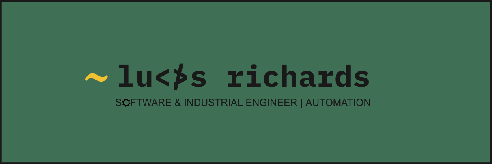

### Hi there 👋

I little bit about me  
:mate: As an engineer, I find great satisfaction in finding solutions to problems and optimizing processes. I'm always on the lookout for ways to automate repetitive tasks, allowing me to focus on adding value to the product.  
🎓 I'm currently working towards a Software Engineering Bootcamp Cert at General Assembly.   
🌱 I'm on track with learning more about new frameworks, AI, Data management, and Software Architecture. 
⚡  In my free time, I enjoy hiking, cooking, and spending time with family. 
💬 Let's have a Meet or Zoom call, feel free to pick a slot on <a href="https://calendly.com/lucasrichardsdev/30min">Calendly </a>to talk with me. 
📫 You can drop me an email at lucasrichardsdev@gmail.com. It will be a pleasure to talk with you! 
📄 Check my page to get to know me a little better. 

